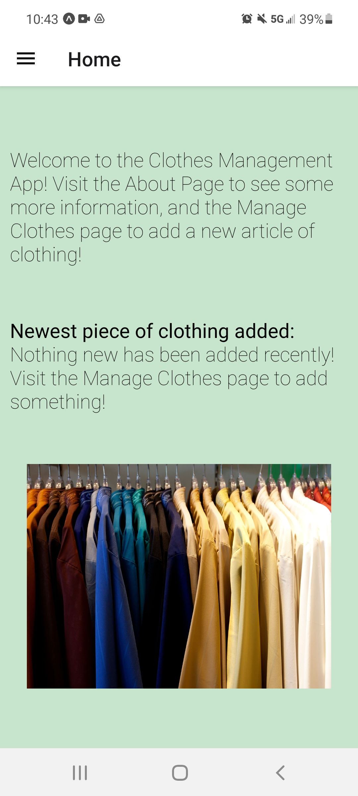
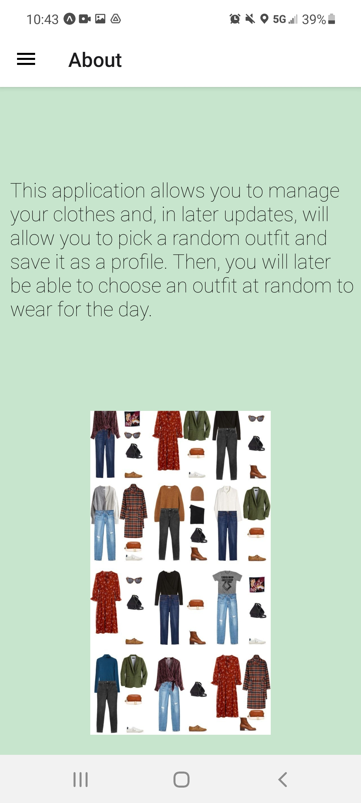
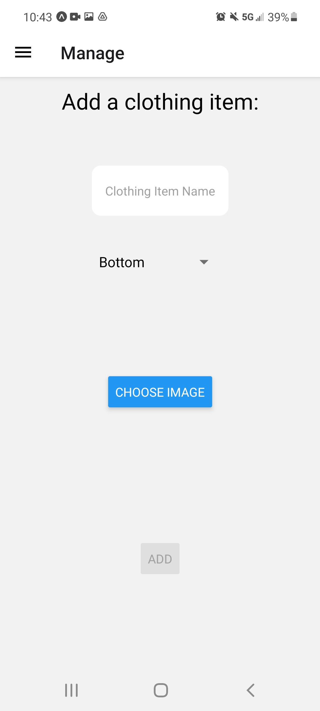
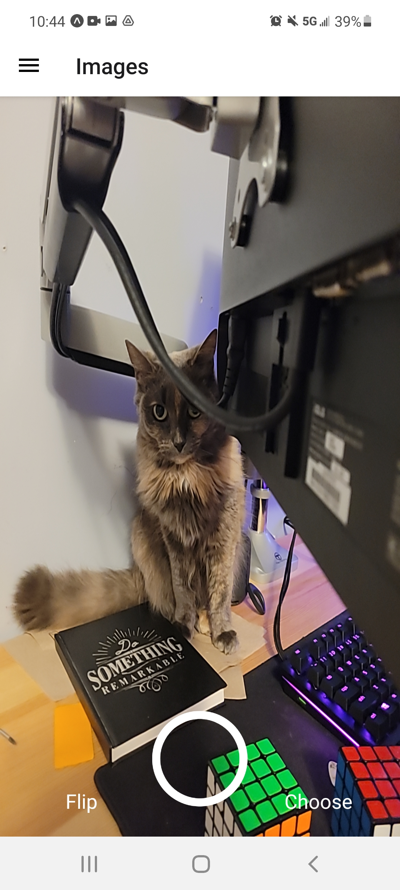
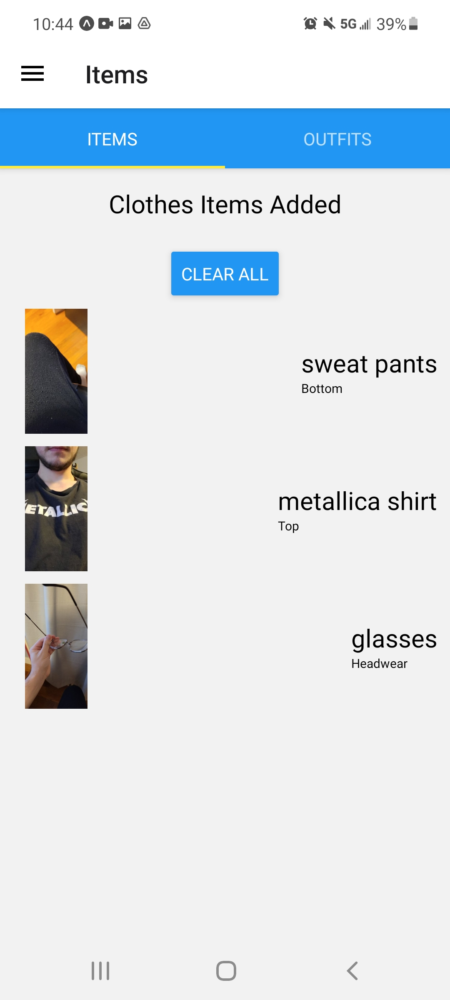
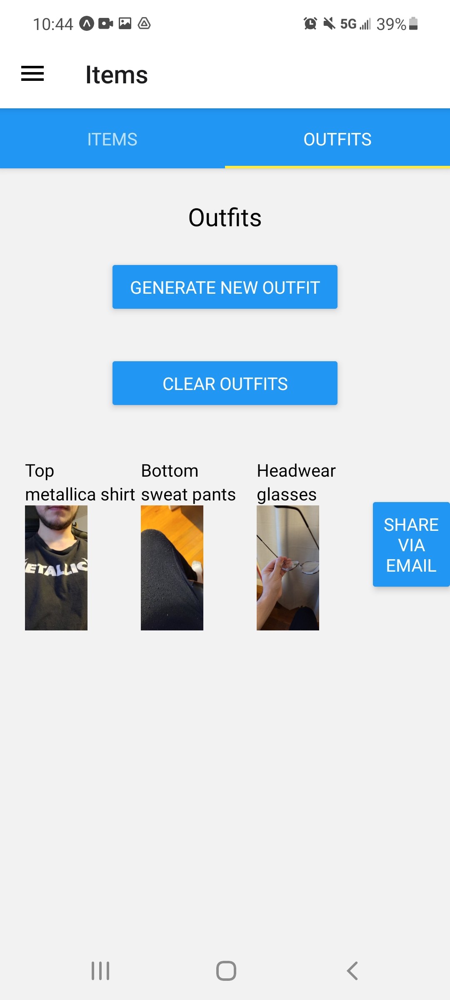

# Clothes Management

## Elevator Pitch

Have you ever wanted to create a custom style for yourself without wasting too much brainpower? Clothes Management is an app that allows you to upload photos of clothing items, categorize them, and create random outfits for you to use whenever you need! With the latest updates, you can also share custom outfits with friends via email.

## Screenshots 








## Technologies Used

Some technolgies used to make this application include:

- React 
- React Native
- Expo
- React Navigation
- qs (Query Management)
- Expo Camera
- Expo Image Picker

This application also uses modern JS techniques, including `useState` and `useEffect` instead of older frameworks that rely on component mounting and unmounting and `this.state`.

## Instructions to Run Locally

To run this app locally, once cloned and redirected into the appropriate folder, please follow these steps:

1. To run on your phone

    ```console
    npm install
    expo start
    ```

    From there, expo will open a window in your browser that will allows you to collect to a set of different devices. To run on your phone, please set the connection to `Tunnel` and scan the QR code with your Expo app. 

2. To run in a web browser

    ```console
    npm install
    yarn web
    ```

    This should open a window in your browser that, once the code is compiled, will open another window in your browser that contains a web version of the code.